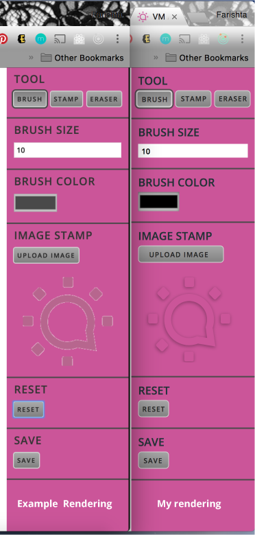

# Paintr - React-Redux Painting App

## Instructions

```bash
git clone git@github.com:LaFrish/drawing-app-challenge.git
cd drawing-app-challenge
npm install
npm start
```
##Open [http://localhost:3000](http://localhost:3000)
---

## Drawing App Capabilities
* Paint Mode
* Image Stamp Mode
* Eraser Mode
* Reset Canvas
* Save Canvas

## Finished Product!

This app was part of a code challenge to create a drawing app in React-Redux and replicate the image provided for the app. Below is the finished product.




## Next Steps

* Add undo & redo function
* Add canvas fill mode
* Add text to canvas functionality
* Add image stamp resizing capabilities
* Add more tests


## Sites

* [Portfolio](http://lafrish.github.io/)
* [Resume](https://drive.google.com/open?id=0B9BDSYdQ3pr8eGxDbzB5SVVKLUdyWWJONHJpTGFBYkpGdFR3)
* [LinkedIn](https://www.linkedin.com/in/farishtahaider)
* [GitHub Repo](https://github.com/LaFrish)
